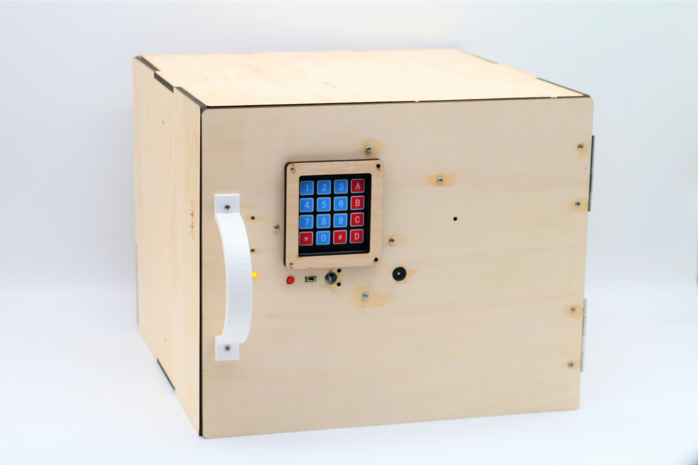
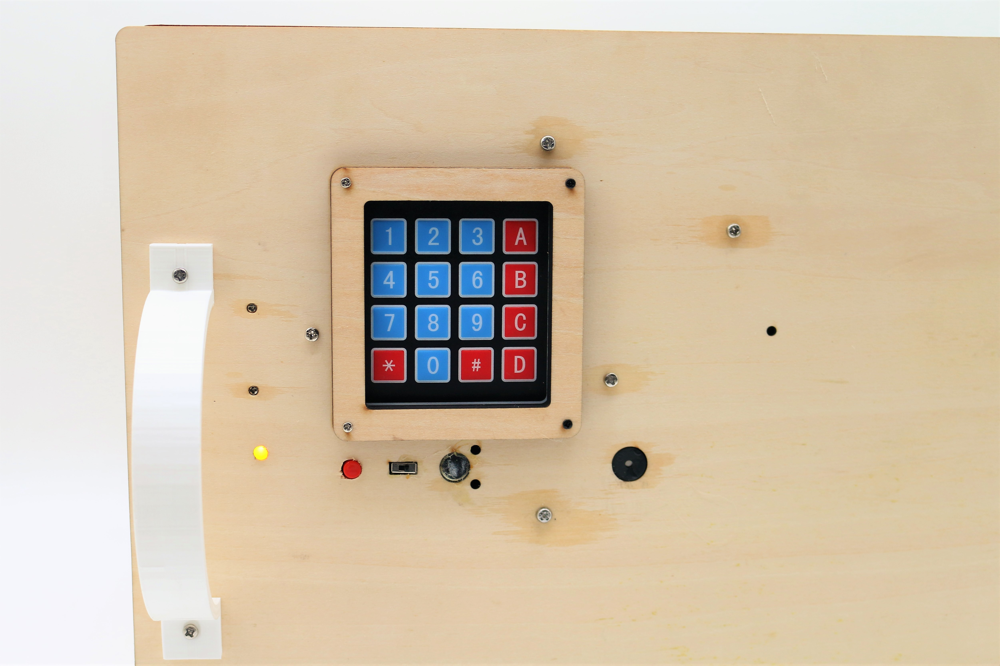
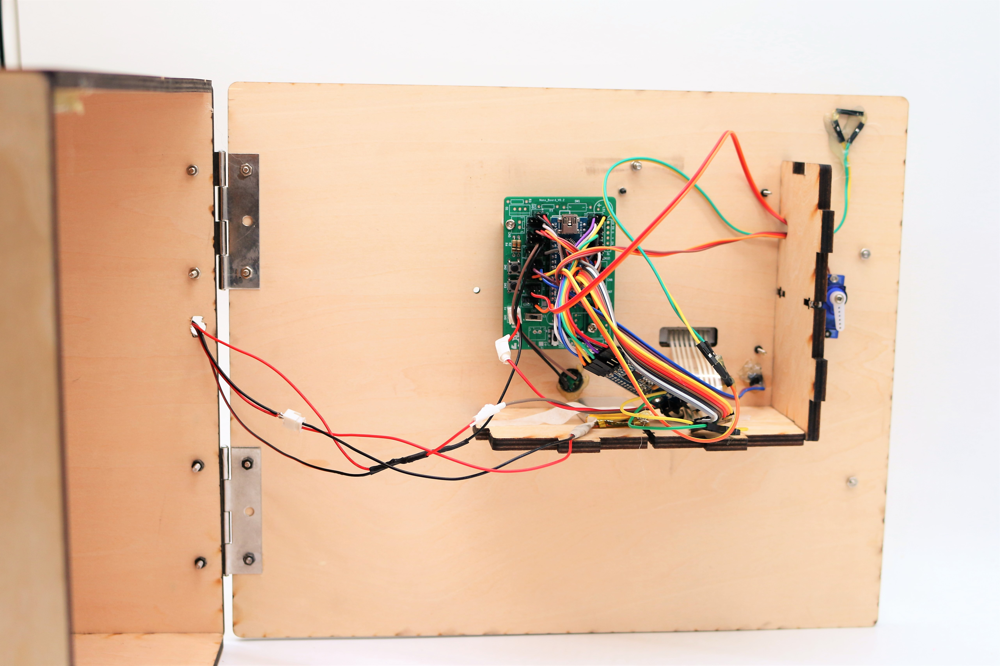
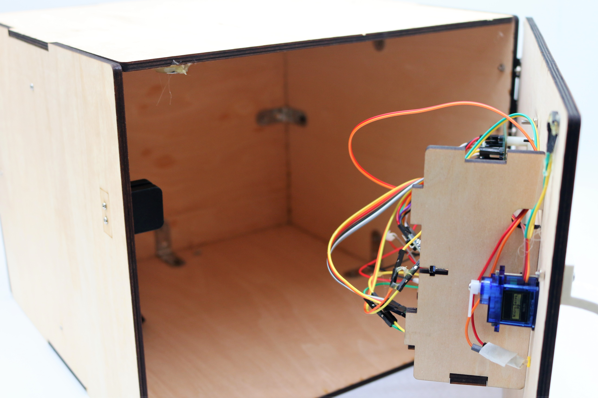

@MG summer camp

# Voice Recognition safebox V1.0（声纹保险箱）
## By Hardi(黄昊)&肖煜瀚 @MG_summer_camp 产品设计营 2019.08.09

# #WARNING!!!!
## To use this program, please make sure you already installed the LD3320 voice Recognition module arduino library

---

## The safebox has two method to open the door, 
## we can either use our secret phrase to unlock it, 
## or we can input our password on the keyboard to unlock the device

## the password is four digit, and using "#" to clear the input, and "*" to comfirm the input,
## and the door will be open if the password is correct.

## by pushing down and hold the voice enable button, we can use our secret phrase to open the door as well.

---

